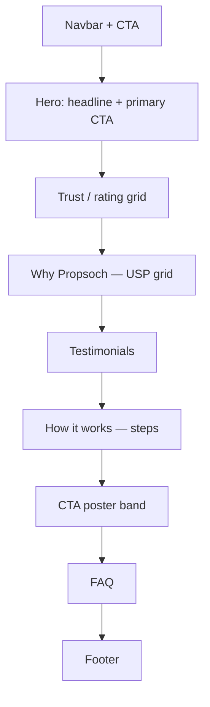

# Propsoch LeadPages Landing-Page Builder

Build conversion-focused **marketing landing pages** for LeadPages (HTML Pub) that strictly follow the **Propsoch design system** — brand colors, Archivo typography, and spacing tokens baked into this skill. Output is standalone HTML (no build step) using the Tailwind v4 browser CDN, so every design-system class resolves at runtime.

**Non-negotiable design rules** (enforce on every page):
1. Content width capped at **`max-w-7xl`** (1280px) — wrap every section's inner content in `max-w-7xl mx-auto px-4 lg:px-8`.
2. **Mobile-first + responsive** — single column by default, `lg:` (1024px) introduces multi-column. Never desktop-only.
3. **Colors only via the baked semantic tokens** — double-prefixed classes (`bg-bg-…`, `text-text-…`, `border-border-…`). See `references/colors.md`. Never invent hex values for UI.
4. **Typography only via the baked scale** — `title` / `para` / `label` class strings. See `references/typography.md`. Font is Archivo.

## Workflow (follow in order)

### 1. Ask the purpose
Ask the user to describe the landing page before doing anything else:
> "What landing page do you want? Tell me its **goal** (what you want out of it), the **audience**, the **offer / primary CTA**, the **city/market**, and any tone preference."

Wait for the answer. Don't assume a layout yet.

### 2. Propose a section flow as a Mermaid diagram
From `references/sections.md`, pick a sensible section sequence for that goal and render it **in chat** as a Mermaid `flowchart TD` (top→down = page order). Briefly justify each section in one line. Use the proven default flow as the starting point, trimmed to the brief.

Example:

### 3. Edit loop
Ask: **"Add, remove, or reorder any section?"** Apply edits, re-render the diagram if it changed, and repeat until the user confirms the flow.

### 4. Build the page
Start from `references/base-template.html`:
- Paste the **full contents of `references/tokens.css`** into the `<style type="text/tailwindcss">` block (it's already inlined in the template — keep it).
- Replace `{{PAGE_TITLE}}`, `{{META_DESCRIPTION}}`, `{{NAV_CTA}}`, `{{FOOTER_BLURB}}`, `{{SECTIONS}}`.
- Build each approved section as `<section>` → inner `
`.
- Alternate section backgrounds white ↔ `bg-bg-neutral-surface` for separation.
- Colors: double-prefixed semantic classes only (`references/colors.md`).
- Typography: `title`/`para`/`label` class strings only (`references/typography.md`).
- Brand voice: confident advisor, benefit-first, data-backed (`references/sections.md`).
- Logo already embedded in navbar (colored) + footer (white). Use other variants from `references/logos/` if needed.

Generate the whole page, then iterate with the user.

### 5. Output
Write the finished HTML to a file (default `~/Downloads/<slug>.html`) so the user can review. Then **offer** to publish via the LeadPages MCP `create_page` — note that free-plan pages expire after 7 days. Don't publish without asking.

## Quick reference

| Need | Where |
|---|---|
| Color class names (double-prefix rule) | `references/colors.md` |
| Heading/body/label class strings | `references/typography.md` |
| Section catalog + default flow + voice | `references/sections.md` |
| Full token CSS (paste into page `<style>`) | `references/tokens.css` |
| Page skeleton (navbar/footer/sticky CTA) | `references/base-template.html` |
| Brand logo SVGs (5 variants) | `references/logos/` |

## Common mistakes

- **Single-prefix color class** (`bg-brand-orange-normal`) → renders nothing. Tailwind v4 emits the literal token name, so it's `bg-bg-brand-orange-normal`. Always double-prefix.
- **Skipping `max-w-7xl`** → content runs edge-to-edge on wide screens. Every section's inner div needs it.
- **Desktop-first** → build mobile layout first, layer `lg:` for desktop.
- **Hardcoding hex / arbitrary font-size px** → use the baked tokens/utilities so the page stays on-brand.
- **Forgetting `tokens.css` in the page** → no design-system class resolves. It must be inside `<style type="text/tailwindcss">`.
- **Building before the user confirms sections** → always run steps 1–3 first.
